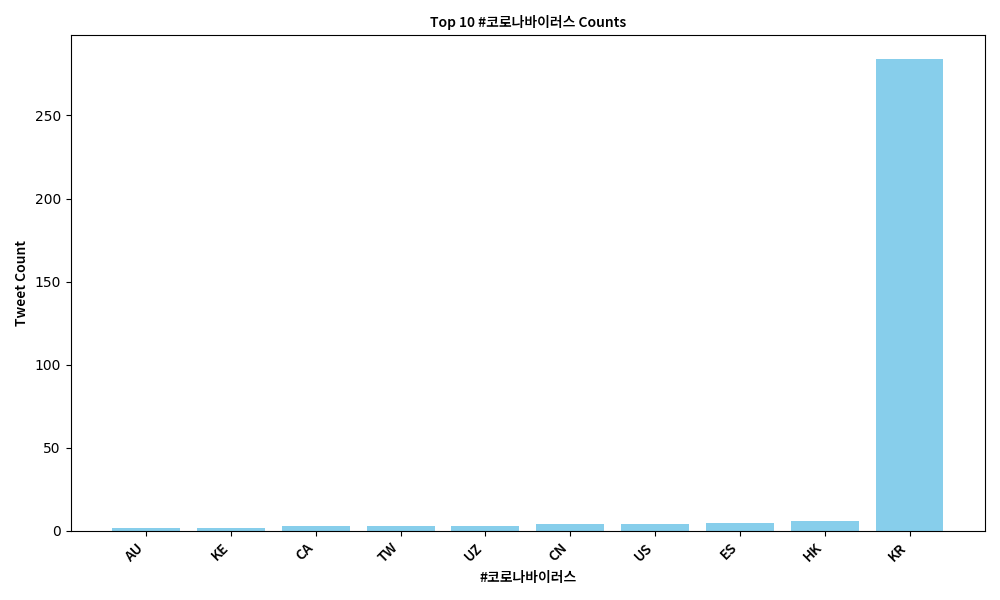

# Analyzing tweets mentioning the Coronavirus in 2020

For this project, I scanned all the geotagged tweets sent in 2020 to monitor COVID-19 awareness on social media platforms like Twitter. There are 500 million tweets sent out every day by users all over the world, so this is definitely a Big Data problem. Although only 2% of those tweets are *geotagged*, the dataset used by this project contains **1 billion+** tweets, making it an effective sample of all tweets sent out in 2020.

## Procedure

To deal with such a high number of tweets, I followed the **MapReduce** procedure to analyze the tweets. It follows 3 steps, partition, map, and reduce. Partitioning involves dividing the data into smaller chunks, ready for mapping. In this case, the data was already partitioned into each day by Mike Izbicki, assistant professor of Computer Science at Claremont McKenna College. So, I had to map the data into key-value pairs using `map.py`, making it suitable for reducing. The reduce step groups the mapped data, which in this case would be looking at unique hashtags, and process their values accordingly. The `reduce.py` and `alternative_reduce.py` in the **src** folder do that for us. Finally, we can use both `alternative_reduce.py` and `visualize.py` to visualize trends in tweets sent out in 2020.

## Data

This is what a typical json file looks like for each day of tweets sent out in 2020. Below is the pretty printed json  `outputs/geoTwitter20-02-16.zip.lang', aka the mapped tweets on 02/16/2020 containing hashtags related to COVID-19.

```
{
  "_all": {
    "und": 6366245,
    "en": 22613111,
    "tl": 1900124,
    "pt": 8967891,
    "es": 6445431,
    "ar": 2867339,
    "ja": 3642063,
    "fr": 1037561,
    "sv": 87499,
    "ht": 189958,
    "tr": 1520871,
    "in": 3064080,
    "nl": 290326,
    "it": 476782,
    "de": 287453,
    "lt": 31484,
    "ca": 145129,
   ... 
  },
  "#doctor": {
    "en": 217,
    "ta": 3,
    "es": 5,
    "lt": 1,
    "und": 39,
    "et": 2,
    "tl": 1,
    "it": 2,
    ...
  },
  "#hospital": {
    "en": 162,
    "ca": 1,
    "es": 10,
    "und": 4,
    "in": 2,
    "hu": 1,
    "pt": 2,
    "fr": 2,
    "et": 1
  },
  "#coronavirus": {
    "und": 75,
    "en": 334,
    "es": 64,
    "it": 30,
    "nl": 6,
    "pt": 13,
    "tr": 10,
    "fr": 22,
    "ro": 1,
    "in": 6,
    "de": 14,
    ...
  }, 

  ```

Grouping these tweets by the hashtags `#coronavirus` and `#코로나바이러스` gives us some informative data on which countries tweeted the hashtags the most and in what languages.

## Results


The U.S. being the first country is not surprising. However, India beats Great Britain in tweets containing `#coronavirus`. India has the largest poulation of non-native English speakers in the world, so this graph shows that not all tweets containing English hashtags are necessarily from the west. 



Again, South Korea being #1 is not surprising. However, we can see some other countries with Korean-speaking populations too!


Diverse spread of languages using the hashtag, English having the highest number.


The highest number of tweets sent out with #coronavirus written in Korean is also in Korean, but a surprising number are also in English. For a future project, it would be interesting to see if these tweets were sent out by English-speaking users in Korea or multilingual Korean & English speakers from outside the country.

## Alternative Reduce

The biggest objective of this project was to look at COVID-19 related hashtags and analyze the spread of information on social media. Could we have predicted the pandemic based on the number of sickness-related tweets being sent out right before the outbreak? Let's see. 


These are the trends for all the hashtag this project is concerned with. As expected, the COVID-19 related hashtags spiked around March 15th, 2020, when most states began quarantine measures against the outbreak. One of the most impressive outcomes of this project was to see the parallels between real-life events and how they reflect on social media. However, the number of COVID-19 related tweets is very high compared to genereal sickness related tweets. Let's look at more general hashtags.


We can see the general trend follow in this figure too, omitting the outliers. However, it is interesting to see how the general spikes in tweets containing these hashtags may have hinted towards an upcoming pandemic. For a future project, I want to dive deeper into hashtags such as `#death' `#died` `#sick` `#feelingsick` to capture any spikes in undiagnosed illnesses and deaths that may have actually occured due to COVID-19 and may have affected immunocompromised people before states realized it was a problem. 
